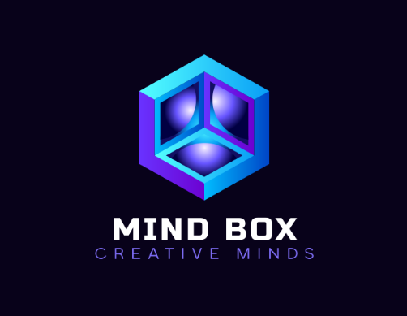
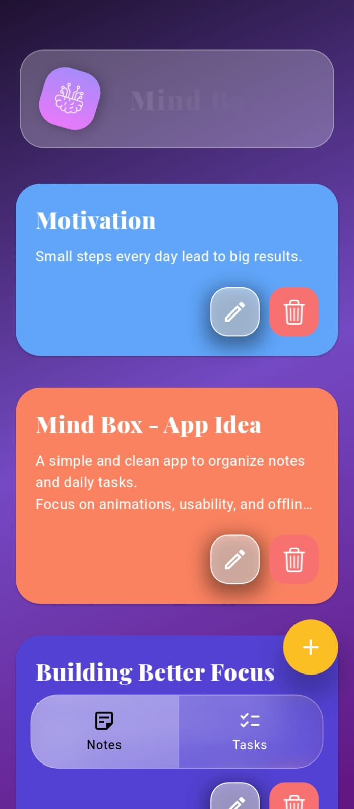
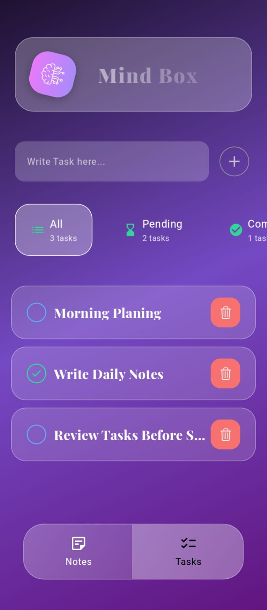
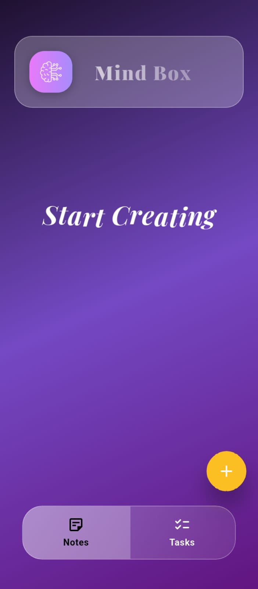

# 🧠 Mind Box

<p align="center">
  
</p>

<p align="center">
  <strong>Mind Box</strong> is a modern Flutter application for managing <b>Notes</b> and <b>Tasks</b> with a clean architecture, smooth animations, and an offline-first local database.
</p>

<p align="center">
  
  
  
  
</p>

---

## 📑 Table of Contents

* [Overview](#-overview)
* [Features](#-features)
* [Tech Stack](#-tech-stack)
* [Architecture](#-architecture)
* [Screenshots](#-screenshots)
* [Getting Started](#-getting-started)
* [Database](#-database)
* [Animations](#-animations)
* [Future Improvements](#-future-improvements)
* [Author](#-author)
* [License](#-license)

---

## 🔍 Overview

**Mind Box** is a productivity-focused Flutter app that helps users capture ideas and organize daily tasks efficiently.
The app is built with **scalability, maintainability, and performance** in mind, following **Clean Architecture principles**.

This project is intended to be a **portfolio-grade application**, showcasing real-world Flutter development skills.

---

## ✨ Features

### 📝 Notes

* Create, edit, and delete notes
* Clean writing experience
* Fast local persistence

### ✅ Tasks

* Add, update, and remove tasks
* Simple task tracking workflow

### 🎨 UI / UX

* Modern, minimal, and responsive design
* Carefully crafted layouts and spacing

### 🎬 Animations

* Smooth animated bottom navigation bar
* Fluid transitions between Notes and Tasks

### 🧱 Architecture

* Clean Architecture (Presentation / Domain / Data)
* Highly maintainable and test-friendly code

### 💾 Offline First

* Local storage using Sqflite
* No internet connection required

---

## 🛠 Tech Stack

* **Framework:** Flutter
* **Language:** Dart
* **Architecture:** Clean Architecture
* **State Management:** BLoC
* **Local Database:** Sqflite
* **Animations:** Flutter Implicit & Explicit Animations

---

## 🧠 Architecture

The app follows **Clean Architecture**, ensuring separation of concerns:

* **Presentation Layer**
  UI, animations, state management

* **Domain Layer**
  Business logic, use cases, entities

* **Data Layer**
  Repositories, local database, models

This approach makes the app:

* Easier to maintain
* Easier to test
* Ready for future scaling (e.g. Firebase sync)

---

## 📸 Screenshots

> Screenshots and GIFs showcasing UI and animations

<p align="center">
  
  
  
</p>


---

## 🚀 Getting Started

### Prerequisites

* Flutter SDK
* Dart SDK
* Android Studio or VS Code

### Installation

```bash
# Clone the repository
git clone https://github.com/your-username/mind-box.git

# Navigate to project directory
cd mind-box

# Install dependencies
flutter pub get

# Run the app
flutter run
```

---

## 🗄 Database

* Local database powered by **Sqflite**
* Structured tables for Notes and Tasks
* Optimized CRUD operations

---

## 🎞 Animations

* Custom animated bottom navigation bar
* Page transitions with smooth motion
* Designed to enhance user experience without overloading UI

---

## 🚧 Future Improvements

* 🔔 Task reminders & notifications
* 🌙 Dark mode
* ☁️ Cloud sync (Firebase)
* 🔐 Authentication

---

## 👨‍💻 Author

**Marwan Gharib**
Flutter Developer & Programmer

* GitHub: [https://github.com/Marwan-Ghareeb](https://github.com/MarwanGhareeb)
* LinkedIn: [www.linkedin.com/in/marwan-gharib](https://www.linkedin.com/in/marwan-gharib)

---

## 📄 License

This project is licensed under the **MIT License**.

---

⭐ If you like this project, consider giving it a star on GitHub!
